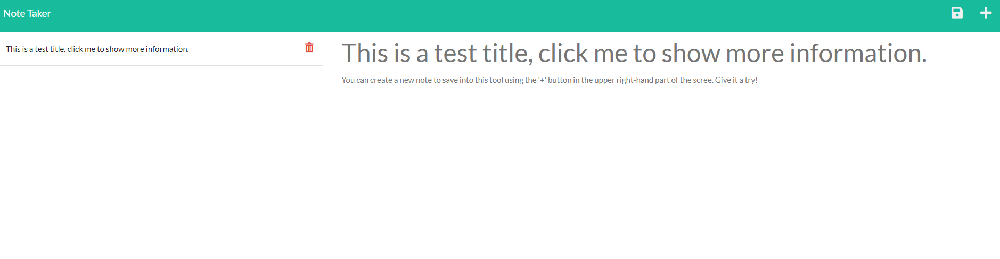

# Table of Contents

  * [Description](#Description)
  * [Installation](#Installation)
  * [Usage](#Usage)
  * [Contributing](#Contributing)
  * [Tests](#Testing)
  * [License](#License)
  * [Contact](#Contact)

# Description

This is note taking app that stores user created custom notes on a server for later viewing. The application is coded using native javascript expressJS and nodeJS code. It is deployed using the hiroku hosting service at https://russellsnotetaker.herokuapp.com/notes

# Installation Instructions

Git Clone from: 
  
git@github.com:nathanrusselldev/russellNoteTaker.git
Then: NPM install NPM start and browse local host. 
Alternitavely: https://russellsnotetaker.herokuapp.com/notes

# Usage

Use to save notes or test the functionality for yourself. 
  

# Contributing

Pull requests welcome. 
  

# License

CC0

# Contact

If you have any questions or concerns I can be contacted via e-mail or github.

  * mailto:nathanrussell.it@gmail.com
  * [https://github.com/nathanrusselldev/](https://github.com/nathanrusselldev)
